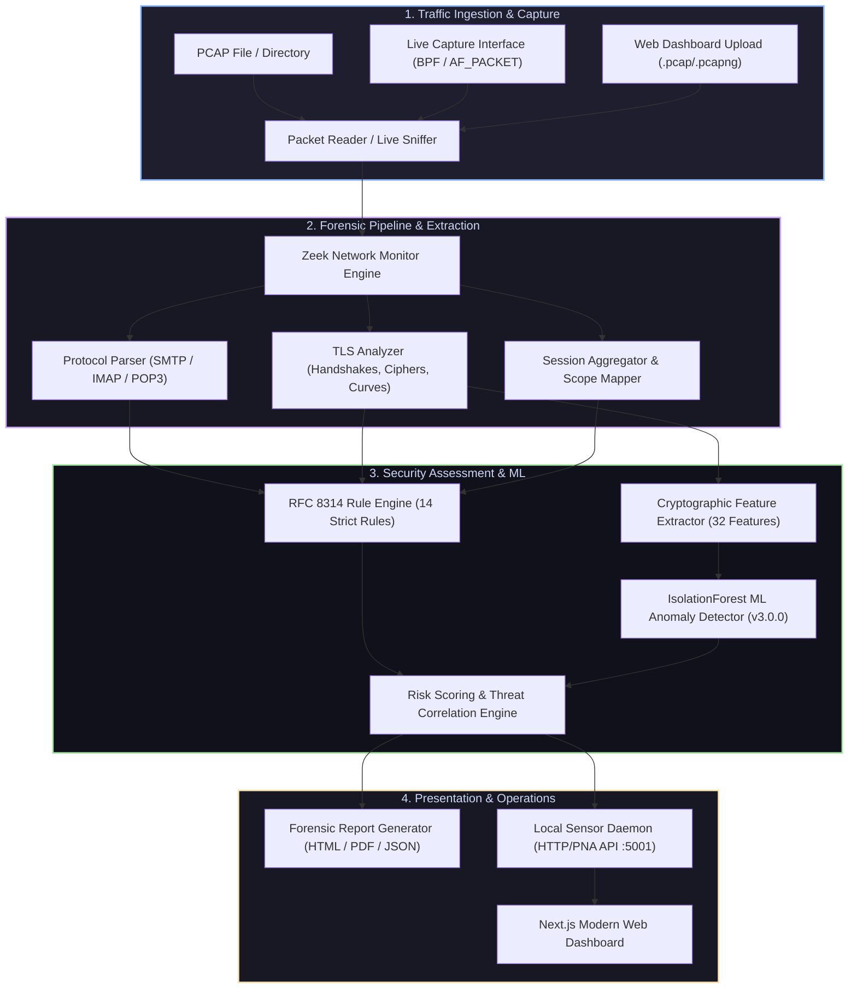
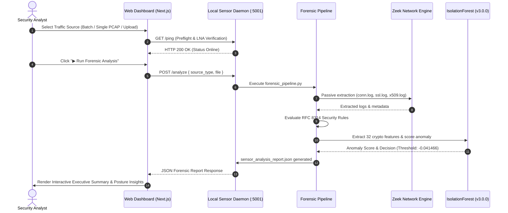
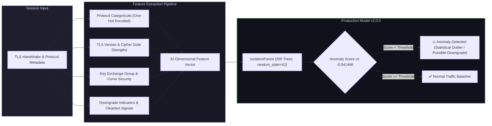

# AI-Assisted Passive Network Forensic Framework for Email Cryptographic Security Posture Assessment

[](https://nextjs.org/)
[](https://python.org)
[](https://zeek.org/)
[](https://scikit-learn.org/)
[](https://datatracker.ietf.org/doc/html/rfc8314)
[](https://docs.pytest.org/)

An enterprise-grade, privacy-preserving passive forensic analysis framework that inspects email network traffic (SMTP, IMAP, POP3), audits cryptographic posture in strict accordance with **RFC 8314**, **RFC 7525**, and **RFC 8446**, and applies unsupervised machine learning (**IsolationForest v3.0.0**) to detect cryptographic anomalies and downgrade attacks without decrypting payload data.

---

## 🏛️ System Architecture



---

## 🔄 End-to-End Forensic Analysis Workflow



---

## 🧠 Machine Learning Engine Architecture



### Production Model Artifact Status
- **Production ML Version**: `v3.0.0` / `expanded_v3`
- **Algorithm**: `IsolationForest` (200 estimators, `contamination="auto"`, `random_state=42`)
- **Feature Schema**: Version `1.0.0` (32 encoded dimensions)
- **Calibrated Decision Threshold**: `-0.041466321224221024`
- **Documented Production SHA-256**: `587b165398eb9eb2ec82213699c5fb96bb67f85fdfd61467a021ae2befcbc791`
- **Artifact Status Note**: The original binary is tracked via Git LFS pointers in the repository. A local deterministic training reconstruction was evaluated producing SHA-256 `193162bb2bcad46d84acbfd09d009865c587fa2c2609d2d92e66bd18b3ac7765`. Because the serialized bytecode hash differs from the canonical reference hash (due to joblib/platform serialization differences), the reconstructed artifact has **not** been promoted to production. All production metadata and integrity manifests remain strictly preserved and uncorrupted.

---

## 📊 Controlled Benchmark & Evaluation Methodology

The framework evaluates anomaly detection and security posture using a controlled 5-fixture benchmark:

| Metric | Controlled Benchmark Value | Note |
| :--- | :---: | :--- |
| **Accuracy** | 80.0% | Controlled 5-fixture benchmark only |
| **Precision** | 100.0% | 0 False Positives on normal traffic |
| **Recall** | 75.0% | High sensitivity to structural anomalies |
| **F1-Score** | 0.8571 | Balanced performance |
| **False Positive Rate** | 0.0% | Clean normal baseline |
| **False Negative Rate** | 25.0% | Conservative statistical decision boundary |

> **Important Methodology Note**:
> - Machine learning anomalies represent statistical deviations in cryptographic/network structure, **not verified attacks**.
> - Domain shift across different network environments will naturally affect anomaly distributions.
> - Benchmark metrics reflect synthetic test fixtures and should not be construed as universal real-world accuracy claims.

---

## ✨ Key Capabilities

1. **Passive Non-Intrusive Inspection**:
   - Analyzes raw packet captures (`.pcap`, `.pcapng`, `.cap`) and live interfaces without active probing or MITM proxying.
   - Extracts metadata via embedded **Zeek** engines and custom Scapy/dpkt protocol decoders.

2. **Strict RFC Cryptographic Assessment**:
   - **RFC 8314**: Flags cleartext legacy ports (25, 110, 143), opportunistic STARTTLS vulnerabilities, and plaintext credential transmissions.
   - **RFC 7525 & RFC 8446**: Enforces TLS 1.3/1.2 minimum standards, detects deprecated ciphers (RC4, 3DES, CBC-mode), and validates Forward Secrecy (ECDHE/DHE).

3. **Production IsolationForest ML (v3.0.0)**:
   - **Model Variant**: `expanded_v3` (200 estimators, 32 cryptographic features).
   - **Calibration**: Decision threshold calibrated to `-0.041466` for optimal recall on cryptographic degradation and anomaly detection.
   - **Integrity**: Verified via SHA-256 fingerprinting on initialization.

4. **Live Monitor & Threat Remediation**:
   - Supports passive real-time live sniffing with explicit user acknowledgment and Berkeley Packet Filter (BPF) sandboxing on local authorized sensors.
   - Actionable, prioritized remediation guidance with direct RFC references.

5. **Cloud-Ready Web Dashboard**:
   - Next.js 14 enterprise SOC dashboard deployed on Vercel (`https://web-one-sigma-vudhfub4re.vercel.app`).
   - Supports input-first analysis workflows (Batch directory, Single PCAP, and Upload).
   - Communicates securely with local privileged sensors via W3C **Private Network Access (PNA)** and Chrome **Local Network Access (LNA)** protocols.

---

## 📂 Project Repository Structure

```
.
├── local_sensor/                  # Local privileged sensor daemon
│   └── server.py                  # HTTP/PNA server (:5001) with CORS & LNA handling
├── part1/                         # Core forensic engine & ML framework
│   ├── datasets/                  # Ground truth datasets & provenance manifests
│   ├── docs/                      # Technical specifications & evaluation reports
│   ├── models/                    # Trained ML models (v3.0.0 IsolationForest)
│   ├── output/                    # Generated reports (HTML, PDF, JSON)
│   ├── pcaps/                     # Standardized email PCAP test fixtures
│   ├── src/                       # Forensic pipeline, Zeek engine, ML modules
│   │   ├── ai_anomaly_detector.py # IsolationForest inference & scoring
│   │   ├── crypto_features.py     # 32-dimensional feature extraction
│   │   ├── forensic_pipeline.py   # Primary pipeline orchestrator
│   │   ├── live_capture.py        # Privileged live packet capture
│   │   ├── risk_engine.py         # Composite risk calculation
│   │   ├── security_rules.py      # RFC 8314 rule evaluation
│   │   └── tls_analyzer.py        # TLS handshake & cipher analysis
│   ├── test_fixtures/             # Keylog & TLS 1.3 synthetic fixtures
│   └── tests/                     # Verification test suite
├── web/                           # Next.js 14 Frontend Web Application
│   ├── src/
│   │   ├── components/            # Dashboard layout, SourceSelector, KPI cards
│   │   ├── pages/                 # Next.js pages (Overview, Sessions, TLS, ML, etc.)
│   │   └── types/                 # TypeScript interfaces for forensic reports
│   ├── package.json
│   └── vercel.json
├── requirements.txt               # Python dependencies
└── README.md
```

---

## 🚀 Quick Start Guide

### Prerequisites
- **Python**: `3.11+`
- **Node.js**: `18.x` or `20.x`
- **Zeek**: `6.0+` (for PCAP extraction and live monitoring)

### 1. Backend & Forensic Pipeline Setup
```bash
# Clone the repository
git clone https://github.com/tirthagarwal/email-forensics.git
cd email-forensics

# Create virtual environment and install dependencies
python3 -m venv venv
source venv/bin/activate
pip install -r requirements.txt
```

### 2. Start the Local Forensic Sensor Daemon
```bash
# Starts the local sensor listening on http://localhost:5001
python3 local_sensor/server.py
```

### 3. Start the Web Dashboard
```bash
cd web
npm install
npm run dev
```
Open [http://localhost:3000](http://localhost:3000) in your browser.

---

## 📜 Standards & References
- **RFC 8314**: Cleartext Replacement in Email Protocols
- **RFC 7525**: Recommendations for Secure Use of TLS and DTLS
- **RFC 8446**: The Transport Layer Security (TLS) Protocol Version 1.3
- **NIST SP 800-52 Rev. 2**: Guidelines for the Selection and Use of TLS Implementations

---

## 🛡️ License & Ethics Notice
*This software is intended for passive network security auditing and authorized forensic investigation. Live packet capture operations require appropriate administrative privileges and network authorization.*

