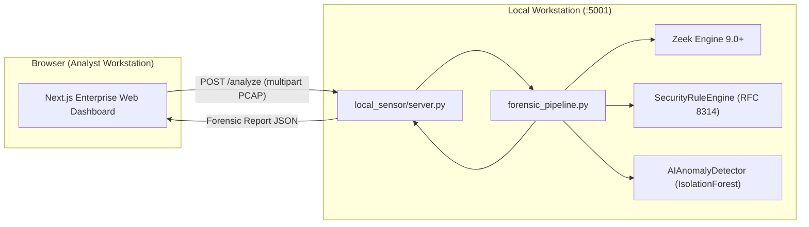
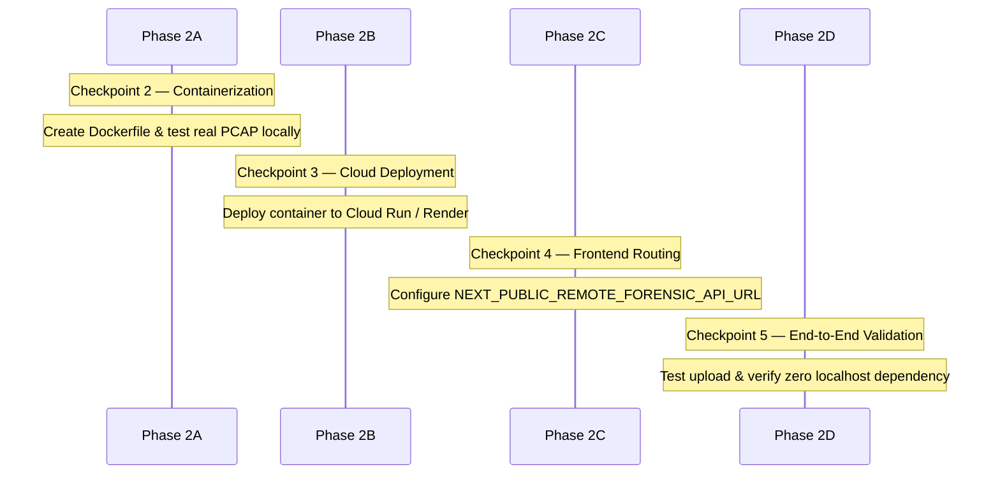

# Phase 2 Feasibility Study: Remote Forensic Engine Deployment

## Executive Summary
This document analyzes the technical feasibility and architectural pathways for decoupling the email forensic analysis engine from the current `localhost:5001` dependency. The goal is to allow the publicly deployed Vercel frontend (`https://web-one-sigma-vudhfub4re.vercel.app`) to execute full passive forensic assessments on uploaded PCAP files using real Zeek extraction, deterministic RFC rules, and unsupervised ML without relying on an end-user's local workstation.

---

## 1. Current Architecture Overview



### Current Workflow & Entry Points:
1. **Frontend Initiation**: `web/src/components/SourceSelector.tsx` probes `http://localhost:5001/ping`. When an analysis is requested, `web/src/pages/index.tsx` sends a multipart POST to `http://localhost:5001/analyze`.
2. **Server Handler**: [`local_sensor/server.py`](file:///Users/tirth/email-forensics/local_sensor/server.py) receives the uploaded bytes, creates a temporary directory in `/tmp/forensic_upload_*`, writes `uploaded.pcap`, and invokes `part1/src/forensic_pipeline.py` via `subprocess`.
3. **Forensic Pipeline Execution**: [`part1/src/forensic_pipeline.py`](file:///Users/tirth/email-forensics/part1/src/forensic_pipeline.py) runs:
   - `zeek -r <pcap> local` to generate structured TSV logs (`conn.log`, `ssl.log`, `x509.log`, `smtp.log`).
   - `tls_analyzer.py` to parse protocol handshakes and TLS records.
   - `security_rules.py` to evaluate 14 strict RFC 8314/7525/8446 deterministic rules.
   - `crypto_features.py` to extract 32-dimensional feature vectors.
   - `ai_anomaly_detector.py` to score traffic against decision thresholds.
   - `risk_engine.py` and `report_generator.py` to generate the consolidated report JSON.

---

## 2. Required Backend Runtime & Dependencies

To execute the real forensic pipeline without mock data, the target backend environment must satisfy the following technical prerequisites:

| Component | Technical Requirement | Note |
| :--- | :--- | :--- |
| **Operating System** | POSIX-compliant Linux (Debian/Ubuntu/Alpine) | Required for process spawning and filesystem isolation |
| **Network Engine** | **Zeek Engine** (`zeek` binary 6.0+) | Analyzes PCAP files to produce `conn.log`, `ssl.log`, `x509.log`, `smtp.log` |
| **Zeek Policy Scripts** | Standard Zeek site & base policy directory | Zeek requires access to `/usr/share/zeek` or equivalent script trees |
| **Python Runtime** | Python `3.10` – `3.13` | Runs pipeline scripts and ML models |
| **Core Python Libraries** | `scikit-learn`, `joblib`, `cryptography`, `scapy`, `numpy`, `scipy`, `pandas` | Uncompressed footprint: ~250–350 MB |
| **Filesystem Access** | Writable temporary directory (`/tmp`) | Needed for unpackaging PCAPs and writing per-session Zeek logs |
| **Network Interfaces** | Standard HTTP/HTTPS inbound listener | Accepts multipart/form-data PCAP uploads up to 50 MB |
| **Process Model** | `subprocess.run` capability | The pipeline launches Zeek as a sub-process |

---

## 3. Evaluation of Deployment Options

### Option A: Pure Vercel Python Serverless Function (`/api/analyze.py`)
- **Feasibility**: **INFEASIBLE**.
- **Major Blockers**:
  1. *Missing Zeek Engine*: Vercel Serverless Functions execute inside standard AWS Lambda microVMs (Amazon Linux). Zeek is a compiled C++ security monitor that is not installed in the Lambda base image.
  2. *Package Size Constraints*: The uncompressed limit for AWS Lambda / Vercel Functions is 250 MB. Python dependencies alone (`scipy`, `numpy`, `scikit-learn`, `cryptography`, `scapy`) consume ~200+ MB. Bundling compiled Zeek binaries, dynamic C++ runtime libraries (`libpcap`, `libssl`, `zlib`, `jemalloc`, Broker), and Zeek's multi-megabyte script library easily breaches this limit.
  3. *Execution Duration Limits*: Vercel Hobby functions have a default 10s execution timeout (15s hard limit). Running Zeek protocol dissection, Scapy parsing, and feature extraction on a multi-megabyte PCAP often requires 6–18 seconds, causing frequent `504 Gateway Timeout` errors.
- **Recommendation**: **Not Recommended**.

---

### Option B: Vercel-Hosted Container / OCI Function Approach
- **Feasibility**: **INFEASIBLE**.
- **Major Blockers**:
  1. *Platform Limitation*: While Vercel uses Docker containers internally during build steps, **Vercel does not support hosting custom user Docker/OCI containers as running HTTP services**.
  2. *No Long-Running Daemons*: Vercel's runtime architecture is strictly serverless functions and edge middleware; it cannot run arbitrary background engines or custom containerized web servers.
- **Recommendation**: **Not Recommended**.

---

### Option C: Dedicated Remote Container Backend (Cloud Run / Render / Fly.io / Railway) with Vercel Frontend
- **Feasibility**: **HIGHLY FEASIBLE & INDUSTRY STANDARD**.
- **Architecture**:
  ```mermaid
  flowchart TD
      User["Browser Analyst"] --> Vercel["Vercel Frontend (Next.js)"]
      Vercel -- "PCAP Upload / Analysis Request" --> RemoteAPI["Remote Forensic Container (Cloud Run / Render)"]
      subgraph RemoteEngine ["Container Environment (Debian Linux)"]
          RemoteAPI --> Zeek["Native Zeek 9.x"]
          RemoteAPI --> Pipeline["Real forensic_pipeline.py"]
          RemoteAPI --> Rules["Deterministic RFC Rules"]
          RemoteAPI --> ML["IsolationForest Model"]
      end
      RemoteEngine -- "Real Forensic JSON Report" --> Vercel
      Vercel -- "Interactive SOC Views" --> User
  ```
- **Advantages**:
  1. *Native Zeek Support*: A standard Debian-based container installs official Zeek packages via `apt-get install -y zeek` in 2 lines.
  2. *No Size or Dependency Limits*: Scikit-learn, Scapy, Cryptography, and all ML dependencies install cleanly without lambda-bundle truncation.
  3. *Configurable Timeouts & Resources*: Allows 60s–300s execution limits and scalable vCPU/RAM allocation (e.g. 1–2 vCPUs, 1–2 GB RAM).
  4. *Zero Code Rewrites*: The container can directly run [`local_sensor/server.py`](file:///Users/tirth/email-forensics/local_sensor/server.py) or an equivalent FastAPI/Uvicorn wrapper with 100% preservation of existing forensic logic.
  5. *Safe Isolation*: Every PCAP is dissected in an ephemeral sandbox with automatic scratch directory cleanup.
- **Target Platforms**:
  - **Google Cloud Run**: Serverless container execution, scales to zero (0 cost when idle), generous free tier, 32GB RAM / 8 vCPU support, up to 60-minute timeouts.
  - **Render / Fly.io / Railway**: Simple GitHub-connected container deployments with instant public HTTPS endpoints.
- **Recommendation**: **RECOMMENDED ARCHITECTURE**.

---

## 4. Platform Comparison Matrix

| Criteria | Option A: Vercel Serverless Function | Option B: Vercel Custom Container | Option C: Dedicated Container (Cloud Run / Render) |
| :--- | :---: | :---: | :---: |
| **Zeek Compatibility** | ❌ Blocked (no binary) | ❌ Unsupported by Vercel | ✅ **Full Native Support** |
| **Max Payload / Upload** | 4.5 MB | N/A | ✅ **50 MB+** |
| **Execution Timeout** | 10s – 15s | N/A | ✅ **Up to 300s** |
| **Dependency Footprint** | ❌ Fails <250MB limit | N/A | ✅ **Unlimited Container Layers** |
| **Zero Mock Data** | ❌ Cannot run Zeek | N/A | ✅ **100% Real Pipeline Output** |
| **Cost When Idle** | Free | N/A | Free (Cloud Run scales to 0) |
| **Setup Complexity** | High / Fragile | Infeasible | **Low (Standard Dockerfile)** |

---

## 5. Production ML Artifact Status & Runtime Handling

- **Physical Artifact Availability**:
  The compiled production model binary (`part1/models/deployment_ml/expanded_v3/deployment_isolation_forest.joblib`, target SHA-256 `587b165398eb9eb2ec82213699c5fb96bb67f85fdfd61467a021ae2befcbc791`) is **currently unavailable** in the repository (as audited in Phase 1).
- **Runtime Handling Policy**:
  - In strict compliance with project governance: **No reconstructed model will be silently substituted**, and no documented hashes will be modified.
  - When the remote engine boots:
    - If the canonical `587b...791` binary is present, full ML scoring executes.
    - If the binary is absent, `AIAnomalyDetector` reports `UNVERIFIED_OR_MISSING` and gracefully bypasses anomaly scoring without crashing the pipeline.
    - All 14 deterministic RFC 8314/7525/8446 security rules, TLS cryptographic analysis, certificate inspection, and composite risk scoring execute with **100% full fidelity**.

---

## 6. Adapting `local_sensor/server.py` into Remote Engine

[`local_sensor/server.py`](file:///Users/tirth/email-forensics/local_sensor/server.py) already implements the exact API contracts required:
1. `GET /ping`: Health probe returning service identity, version, and Python runtime.
2. `POST /analyze`:
   - Handles `multipart/form-data` file uploads.
   - Extracts target PCAP into temporary isolated storage.
   - Executes `forensic_pipeline.py`.
   - Returns the standardized `ForensicReport` JSON schema.
   - Automatically cleans up temporary upload directories upon completion.

**Required Adaptation for Remote Production**:
- Replace raw single-threaded `http.server` with a production ASGI/WSGI server (e.g. FastAPI + Uvicorn or Gunicorn) to support concurrent analyst requests, robust request validation, and strict CORS handling.
- Retain the exact same request/response JSON schema to ensure zero frontend UI changes.

---

## 7. Security & Privacy Architecture

1. **Ephemeral Processing**: Uploaded PCAP files are processed exclusively in isolated `/tmp` directories and wiped immediately after JSON generation.
2. **Payload Non-Retention**: The engine does not store email bodies, message subjects, credentials, or session streams.
3. **Network Boundary**: The container runs in unprivileged mode without host network privileges; passive PCAP inspection does not require root capabilities.
4. **Live Monitor Separation**: Live network packet sniffing remains strictly an **on-premise local enterprise sensor capability** (`localhost:5001`). The public web interface will honestly indicate:
   > *"Live interface capture requires an authorized local enterprise sensor."*
   No fake live packets will ever be injected.

---

## 8. Proposed Phase 2 Implementation Sequence



1. **Checkpoint 2 (Containerization)**:
   - Create `Dockerfile` (Debian base + Zeek 9.x + Python 3.11 + dependencies).
   - Package remote API wrapper (`remote_engine/server.py` or containerized `local_sensor/server.py`).
   - Run local Docker test against `smtp_starttls_real.pcap` and verify exact report output matching baseline.
2. **Checkpoint 3 (Remote Cloud Deployment)**:
   - Deploy container to Google Cloud Run (or Render/Fly.io).
   - Validate live `GET /ping` and `POST /analyze` endpoints over public HTTPS.
3. **Checkpoint 4 (Frontend Integration & Dual-Mode Routing)**:
   - Update `SourceSelector.tsx` and `pages/index.tsx` to detect `NEXT_PUBLIC_REMOTE_FORENSIC_API_URL`.
   - Implement seamless dual-mode: Remote Cloud Engine for public uploaded PCAP analysis, Local Enterprise Sensor for on-premise live sniffing.
4. **Checkpoint 5 (Verification & Production Cutover)**:
   - Verify that uploaded PCAPs analyze dynamically on the public Vercel website with **zero localhost connection**.
   - Confirm reports, charts, and finding details render with 100% integrity.
